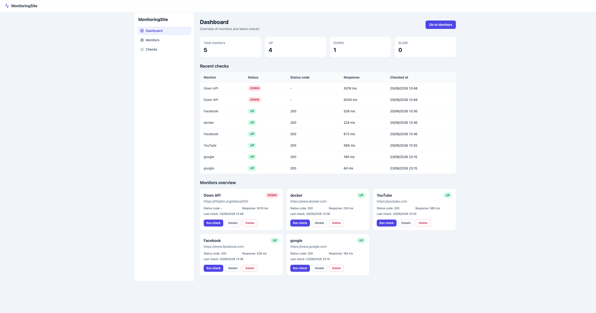
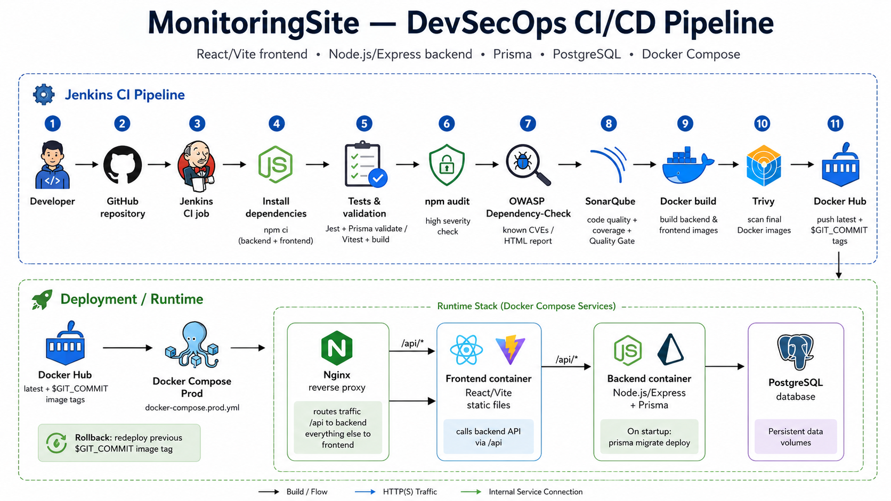
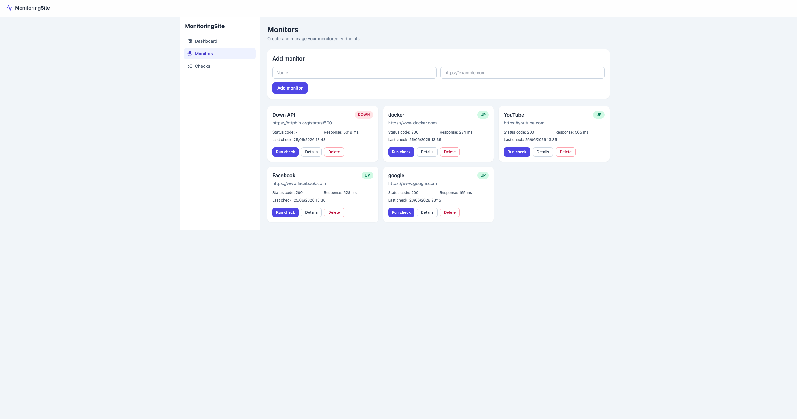
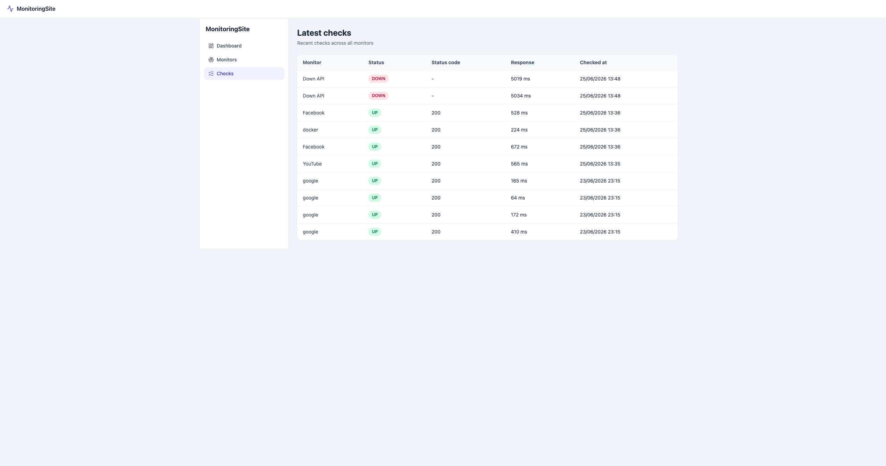
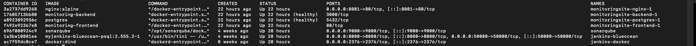
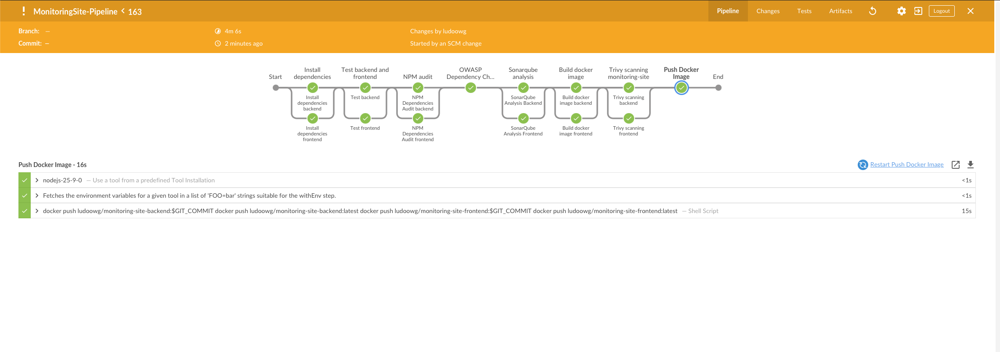
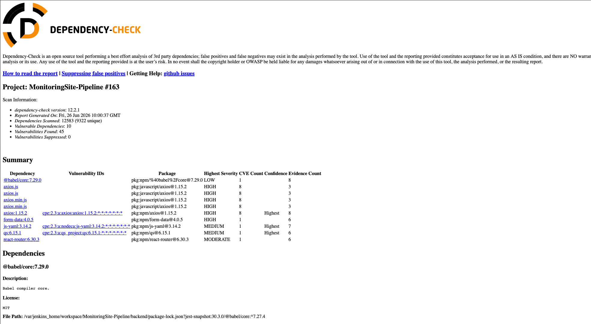
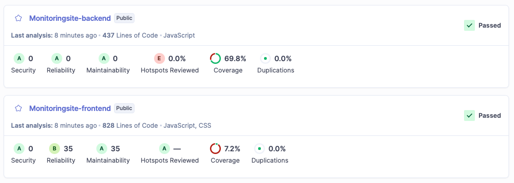
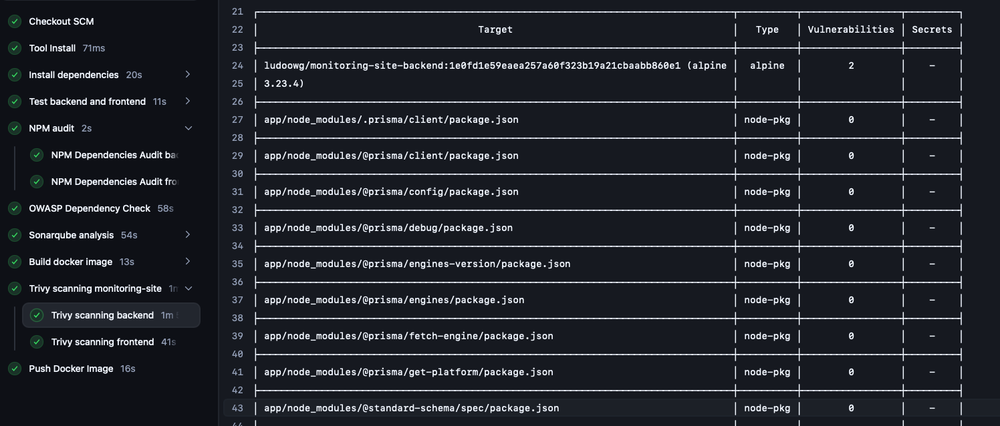
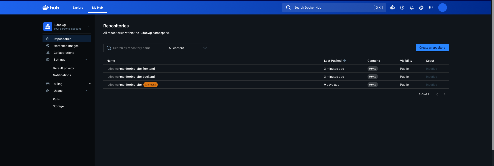

# Monitoring Site — DevOps (local deployment)

**Stack:** React + Vite (frontend) · Node.js + Express + Prisma (backend) · PostgreSQL · Nginx · Docker · Jenkins

**Pipeline:** npm audit · OWASP Dependency-Check · SonarQube · Docker image build · Trivy · push to Docker Hub

---

## Introduction

I built a website monitoring application: users can register URLs to watch, run health checks, and review status and history. The stack is a React frontend for the UI, a Node.js backend with Prisma for the API and data access, and PostgreSQL for persistent storage.

To keep quality and security under control, I use Jenkins for CI/CD. The pipeline runs dependency checks (npm audit and OWASP Dependency-Check), static analysis with SonarQube on backend and frontend separately, then builds Docker images for both services. Trivy scans those images before they are pushed to my Docker registry. This README documents version 1 of the project: local DevOps setup and the full pipeline.



---

## Table of contents

1. [Project overview & goals](#1-project-overview--goals)
2. [Architecture](#2-architecture)
3. [Application stack](#3-application-stack)
4. [Local development](#4-local-development)
5. [Docker & containerization](#5-docker--containerization)
6. [CI/CD with Jenkins](#6-cicd-with-jenkins)



---

## 1. Project overview & goals

### What the application does

Monitoring Site is a lightweight uptime monitoring tool. You register **monitors** (URLs to watch), run **checks** against them, and see whether each site is responding correctly.

Each check measures the HTTP response and assigns a status:

| Status | Meaning |
|--------|---------|
| **UP** | Response OK (2xx–3xx) within the configured threshold |
| **SLOW** | Response OK but slower than the threshold |
| **DOWN** | HTTP error (4xx/5xx) or network failure |
| **UNKNOWN** | Monitor created but not checked yet |

The UI is split into four main views:

- **Dashboard** — global summary (counts of UP / DOWN / SLOW), recent checks, and monitor overview
- **Monitors** — list of registered sites, add/delete monitors, trigger a manual check
- **Monitor details** — history of checks for one monitor
- **Checks** — full history of all checks across every monitor





### Use case

The app targets a simple operational need: know quickly if a website or API endpoint is reachable and how fast it responds. It is a **V1 POC** — suitable for personal use, demos, or learning — not a multi-tenant SaaS with authentication or alerting yet.

### Version 1 — scope

**Included:**

- Full-stack app (React + Vite frontend, Node.js + Express + Prisma backend, PostgreSQL)
- Containerized with Docker (separate images for backend and frontend, Nginx reverse proxy)
- Runnable locally via Docker Compose (dev and prod compose files)
- Automated tests (Jest backend, Vitest frontend) with coverage
- Jenkins CI/CD pipeline: npm audit, OWASP Dependency-Check, SonarQube, Docker build, Trivy scan, push to Docker Hub

**Out of scope for V1:**

- Production deployment on a remote server (images are built and pushed, but deploy is manual)
- Kubernetes orchestration
- Infrastructure monitoring (Prometheus, Grafana)
- User accounts, roles, or email/Slack alerts

### V2 — planned direction

Move from Docker Compose on a single machine to Kubernetes, and add observability ( Prometheus + Grafana) to monitor the monitoring platform itself.

### Learning goals

The main objective of this first version is to understand the full lifecycle of a full-stack application with DevOps practices: design the app, write and run tests, containerize services, wire a CI/CD pipeline, and apply security and quality checks before publishing images. Docker Compose and Jenkins are the foundation; Kubernetes comes in V2.

---


## 2. Architecture

### Request flow

When a user opens the app, everything goes through the **browser**. The only service exposed on the host is the **reverse-proxy Nginx** (`localhost:8081`).

**Loading the UI (`/`):**

```
Browser → Nginx (reverse proxy, :8081)
        → Frontend container (Nginx static server, :80)
        → React build (HTML / JS / CSS)
```

**API calls (`/api/...`):**

```
Browser → Nginx (reverse proxy, :8081)
        → Backend (Express, :3000)
        → PostgreSQL (via Prisma)
```

### Services (4 containers)

| Service | Role | Exposed to host? |
|---------|------|------------------|
| **nginx** | Reverse proxy — routes `/` and `/api/` | Yes (`8081:80`) |
| **frontend** | Serves the built React app (Nginx as static file server) | No (internal only) |
| **backend** | REST API (Express + Prisma) | No (internal only) |
| **postgres** | Persistent data storage | No (internal only) |


### Docker network

All services run on the same bridge network: `monitoring-network`. Containers resolve each other by **service name** (`frontend`, `backend`, `postgres`) — Docker’s embedded DNS. 

Only Nginx publishes a port to the host. Backend, frontend, and Postgres stay on the internal network. That **reduces the attack surface**: fewer entry points from outside Docker, even though services still talk to each other inside the stack.

### Dev vs prod Compose files

| File | Purpose |
|------|---------|
| `docker-compose.yml` | **Local dev** — builds images from `backend/Dockerfile` and `frontend/Dockerfile` (`build:`) |
| `docker-compose.prod.yml` | **Prod-like run** — pulls pre-built images from Docker Hub (`image: ludoowg/monitoring-site-*`) |


---


## 3. Application stack

### 3.1 Frontend (React + Vite)


IMAGE MAINPAGE AND OTHER PAGE 

### Frontend API Communication

The frontend uses Axios to send HTTP requests to the backend API.  
The API base URL is configured with the `VITE_API_URL` environment variable, which makes it possible to switch the backend API endpoint depending on the environment.
The frontend is built into static files and served by an Nginx static web server running inside the frontend container on port 80.

### 3.2 Backend (Node.js + Express + Prisma)


The backend uses Prisma as an ORM to interact with the PostgreSQL database.
The Prisma schema is intentionally simple and contains two main models: `Monitor` and `Check`. A monitor represents a website or service that needs to be monitored, while a check represents the result of a monitoring attempt, including its status and response time.
The schema also defines enums such as `MonitorStatus` and `CheckStatus` to keep the application states consistent and easier to manage.
The backend exposes API routes to perform CRUD operations on monitors and to manage monitoring checks. It also provides a `/health` route, which can be used to verify that the backend service is running correctly.
During container startup, Prisma migrations are applied with `prisma migrate deploy` to ensure that the database schema is up to date before the backend starts handling requests. This helps prevent inconsistencies between the backend code, Prisma schema and PostgreSQL database. 


---

## 4. Local development


## Local Development Setup

This project was developed on a MacBook Pro M2 using Node.js and Docker Desktop for Mac.
To run the project locally, Node.js and Docker Desktop must be installed on the machine.
The project uses environment variables to manage configuration and sensitive values. Local `.env` files are used for the backend, the frontend and the root Docker Compose setup. These files are not committed to Git in order to avoid exposing sensitive data.

Example environment files are provided to document the required variables:

```text
backend/.env.example
frontend/.env.example
.env.example
```

Before running the project, copy the example files and complete them with your local values.

### Run without Docker

Clone the repository and install the dependencies in both the backend and frontend folders.

Backend:

```bash
cd backend
npm install
npm run dev
```

Frontend:

```bash
cd frontend
npm install
npm run dev
```

Make sure all required environment variables are correctly defined before starting the services.

### Run with Docker Compose

From the root of the project, run:

```bash
docker compose up --build
``` 

Docker Compose will build and start the frontend, backend, PostgreSQL database and Nginx reverse proxy services.
Make sure the required `.env` files are completed before running the command.

If you want to run the project locally using the pre-built Docker images, you can use the production Compose file:

```bash
docker compose -f docker-compose.prod.yml pull
docker compose -f docker-compose.prod.yml up -d
```

This will pull the backend and frontend images from the Docker image repositories configured in `docker-compose.prod.yml`, instead of rebuilding them locally from the Dockerfiles.

If a deployment introduces an issue, the application can be rolled back by changing the image tag in `docker-compose.prod.yml` to a previous `$GIT_COMMIT` tag and restarting the services:

```bash
docker compose -f docker-compose.prod.yml pull
docker compose -f docker-compose.prod.yml up -d
```

Using Git commit tags makes deployments more traceable and allows the application to be restored to a previously validated image version.



---

## 5. Docker & containerization


### Docker Images and Build Strategy

The project uses two separate Docker images: one for the frontend and one for the backend.
This separation makes the architecture easier to maintain because both services have different technologies, dependencies and runtime requirements. It also allows each service to be built, updated, scanned and deployed independently without affecting the other one.
Both Dockerfiles use multi-stage builds in order to reduce the final image size and keep only the files required at runtime.
For the frontend image, the Docker Compose configuration passes `VITE_API_URL` as a build argument. This is required because Vite environment variables are injected at build time into the generated static files, instead of being read dynamically at container runtime.
The backend Dockerfile generates the Prisma Client during the image build. At container startup, the backend runs Prisma migrations with `prisma migrate deploy` before starting the Node.js server. This ensures that the database schema is up to date before the application starts handling requests.
Both the frontend and backend folders include a `.dockerignore` file to reduce the Docker build context. This prevents unnecessary or sensitive files such as `node_modules`, `.env`, coverage reports, cache files and local development artifacts from being sent to the Docker daemon during the build.


---

## 6. CI/CD with Jenkins

This project includes a Jenkins CI/CD pipeline used to automate testing, code quality analysis, security checks, Docker image builds and image publishing.
Jenkins runs locally inside a Docker container and must be configured with the required tools and plugins, including Node.js, OWASP Dependency-Check, SonarQube Scanner, Docker and the HTML Publisher plugin.
To avoid keeping too many old build files and reports, the pipeline is configured to keep only the last 30 builds and the last 30 archived artifacts.

### Pipeline Overview

The Jenkins pipeline is composed of several stages:



#### 1. Install Dependencies

The pipeline starts by installing backend and frontend dependencies in parallel.
It uses `npm ci` instead of `npm install` to ensure deterministic dependency installation based on the `package-lock.json` file. This makes CI/CD and Docker builds more reproducible and prevents unexpected dependency updates during automated builds.

#### 2. Tests and Build Validation

The backend and frontend are tested in parallel.
For the backend, the pipeline runs Jest tests with coverage and executes `npx prisma validate` to make sure the Prisma schema is valid.
For the frontend, the pipeline runs Vitest tests with coverage and also executes a production build. This build validation ensures that the React/Vite application can be compiled successfully before creating the Docker image.

#### 3. NPM Audit

The pipeline runs `npm audit` on both the backend and the frontend dependencies.
The audit is configured to detect high severity vulnerabilities. During development, this stage is wrapped with `catchError` so that detected vulnerabilities mark the build as unstable instead of completely stopping the workflow.

#### 4. OWASP Dependency-Check

OWASP Dependency-Check is used to complement `npm audit` by scanning the backend and frontend dependencies for known CVEs.
The scan is executed on both folders and generates a global dependency report. The HTML report is then published in Jenkins, making it easier to review vulnerable dependencies, CVE references and possible remediation actions.



#### 5. SonarQube Analysis

SonarQube is used to analyze code quality, maintainability, reliability, test coverage and potential bugs.
The backend and frontend are analyzed as two separate SonarQube projects. This separation makes the results easier to understand because both parts of the application have different codebases, test reports and responsibilities.

SonarQube helps detect issues such as:
- bugs
- code smells
- duplicated code
- maintainability issues
- reliability issues
- test coverage gaps

The pipeline also uses a Quality Gate to decide whether the code quality is acceptable before continuing.



#### 6. Docker Image Build

After the code, tests and security checks have been validated, the pipeline builds two separate Docker images:

- `ludoowg/monitoring-site-backend`
- `ludoowg/monitoring-site-frontend`

Each image is built with two tags:

- `$GIT_COMMIT`, to keep a precise and traceable version of the image
- `latest`, to identify the most recent build

Using separate images for the backend and frontend makes it possible to update, scan and deploy each service independently.

#### 7. Trivy Image Scan

Trivy is used to scan the backend and frontend Docker images for vulnerabilities.
The pipeline scans both images and focuses on `HIGH` and `CRITICAL` vulnerabilities. The table output is displayed directly in the Jenkins logs, while the JSON reports are archived as Jenkins artifacts for later review.
This helps verify that the final Docker images do not contain critical vulnerabilities before being pushed to the registry.





#### 8. Push to Docker Hub

Once the images have been built and scanned, the pipeline pushes them to Docker Hub.
Both the `$GIT_COMMIT` and `latest` tags are pushed for the backend and frontend images.
The images are publicly available on Docker Hub and can be pulled to run the application without rebuilding it locally.




