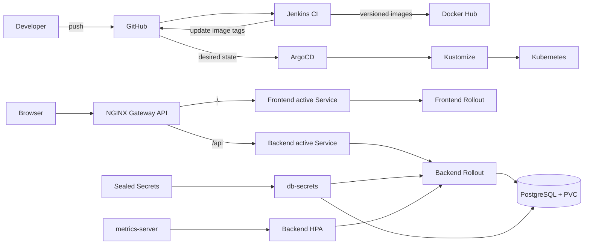
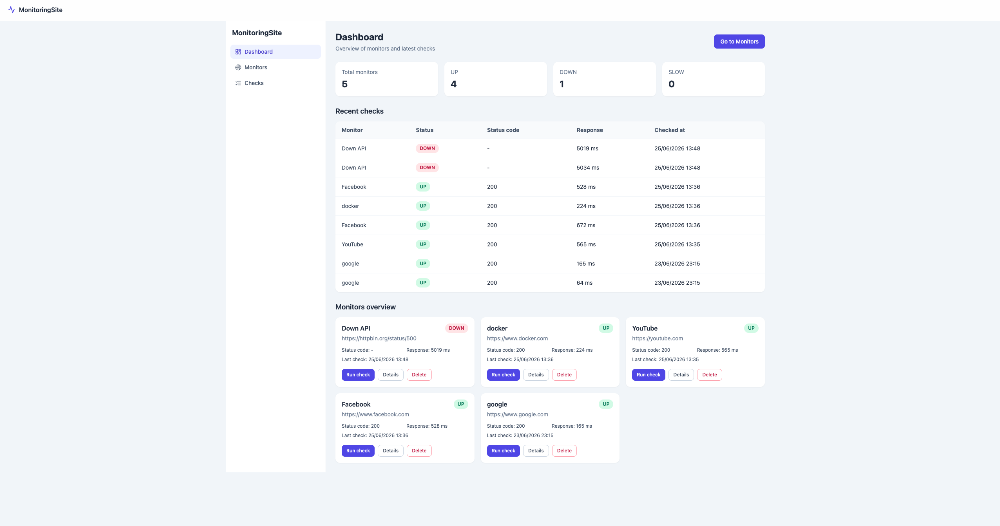
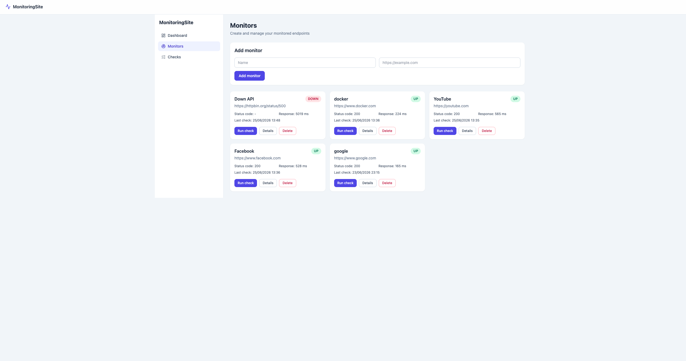
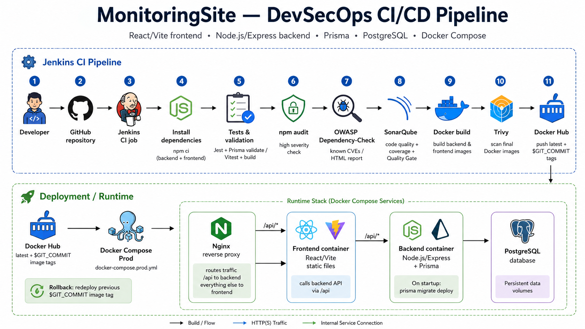

# Monitoring Site — DevOps, CI/CD & GitOps

Monitoring Site is a full-stack uptime monitoring application and a production-like DevOps lab. It demonstrates the complete path from source code to a controlled Kubernetes release using Jenkins, Docker, ArgoCD, Sealed Secrets, and Argo Rollouts.

The application remains a portfolio POC rather than a public multi-tenant SaaS. The infrastructure evolved from a Docker Compose deployment into a local Kubernetes GitOps platform.

## Highlights

- Full-stack monitoring application built with React, Express, Prisma, and PostgreSQL
- Multi-stage Docker images for independent frontend and backend releases
- Jenkins pipeline covering tests, quality checks, dependency audits, image scanning, and publication
- Immutable Docker image tags based on the Git commit SHA
- Kustomize base with development and production overlays
- GitOps reconciliation, pruning, and drift correction with ArgoCD
- Encrypted Git-managed credentials with Sealed Secrets
- Blue/green frontend and backend releases with manual promotion using Argo Rollouts
- Gateway API routing, health probes, persistent storage, and backend autoscaling

## Architecture


```mermaid
flowchart LR
    Developer[Developer] -->|push| GitHub[GitHub]
    GitHub --> Jenkins[Jenkins CI]
    Jenkins -->|versioned images| Registry[Docker Hub]
    Jenkins -->|update image tags| GitHub

    GitHub -->|desired state| ArgoCD[ArgoCD]
    ArgoCD --> Kustomize[Kustomize]
    Kustomize --> Cluster[Kubernetes]

    User[Browser] --> Gateway[NGINX Gateway API]
    Gateway -->|/| FrontendActive[Frontend active Service]
    Gateway -->|/api| BackendActive[Backend active Service]

    FrontendActive --> FrontendRollout[Frontend Rollout]
    BackendActive --> BackendRollout[Backend Rollout]
    BackendRollout --> Postgres[(PostgreSQL + PVC)]

    Sealed[Sealed Secrets] --> Secret[db-secrets]
    Secret --> BackendRollout
    Secret --> Postgres

    Metrics[metrics-server] --> HPA[Backend HPA]
    HPA --> BackendRollout
```

```text
Code push → Jenkins → Docker Hub → image tag committed to Git
          → ArgoCD → Kustomize → Argo Rollouts → Kubernetes
```

## Application

Users can register URLs, trigger HTTP checks, and inspect uptime status and response history.

Each check produces one of four states:

- `UP`: successful response within the configured threshold
- `SLOW`: successful response above the response-time threshold
- `DOWN`: HTTP error or network failure
- `UNKNOWN`: monitor has not been checked yet

The interface contains a dashboard, monitor list, monitor details, and global check history.





## Technology stack

**Application**

- React 18, Vite, React Router, React Query, Axios
- Node.js, Express 5, Zod, Prisma
- PostgreSQL

**CI and security**

- Jenkins
- Jest and Vitest
- npm audit and OWASP Dependency-Check
- SonarQube
- Trivy

**Containers and delivery**

- Docker and Docker Compose
- Docker Hub
- Kubernetes and Kustomize
- ArgoCD
- Sealed Secrets
- Argo Rollouts
- NGINX Gateway Fabric and Gateway API
- metrics-server and HPA

## Evolution of the project

### V1 — Docker and Jenkins

The first version established the application, local Docker Compose architecture, and Jenkins pipeline. Nginx was the only service exposed to the host and routed `/` to the frontend and `/api` to the backend. Backend, frontend, and PostgreSQL remained on an internal Docker network.

The pipeline installs dependencies, runs backend and frontend tests, performs quality and security checks, builds separate Docker images, scans them, and publishes both commit-specific and `latest` tags to Docker Hub.



### V2 — Kubernetes and GitOps

The second version moved orchestration to Kubernetes:

- Kustomize generates development and production configurations from a shared base.
- ArgoCD continuously reconciles the production overlay from Git.
- Sealed Secrets allows the encrypted PostgreSQL Secret to be versioned safely.
- Argo Rollouts replaces Deployments with controlled blue/green releases.
- Active and preview Services separate stable traffic from release validation.
- Gateway API routes browser and API traffic to the active versions.
- The backend HPA scales its Rollout between 2 and 4 replicas from CPU metrics.

The Kubernetes environment currently runs locally with Docker Desktop.

## Key technical decisions

### ArgoCD instead of deploying from Jenkins

Jenkins builds, validates, and publishes artifacts, but does not run `kubectl apply`. It commits the new immutable image tags to Git. ArgoCD then reconciles the cluster, keeping Git as the deployment source of truth and avoiding direct cluster credentials in Jenkins.

### Sealed Secrets instead of plaintext Kubernetes Secrets

The plaintext Secret remains local. Only a SealedSecret encrypted for the cluster is committed. ArgoCD applies it, and the Sealed Secrets controller creates the Kubernetes Secret without exposing plaintext values in Git.

### Blue/green releases

The stable version continues serving users while a candidate version starts behind a preview Service. Automatic promotion is disabled so the candidate can be checked before the active Service switches to it.

### Kustomize overlays

A shared base avoids duplicating manifests, while overlays customize replica counts, resources, HPA configuration, and production image tags.

### Stateful PostgreSQL

PostgreSQL uses a StatefulSet, stable internal Service, and PersistentVolumeClaim. Database data survives pod recreation as long as the underlying volume is retained.

## Challenges and lessons learned

- Resolved a conflicting GatewayClass by letting NGINX Gateway Fabric own the class installed by Helm.
- Replaced strategic merge patches with JSON 6902 patches when Kustomize could not safely merge container fields in the Rollout CRD.
- Added ArgoCD `ignoreDifferences` for the backend Rollout replica field so self-healing does not conflict with HPA decisions.
- Diagnosed an ArgoCD Application deletion blocked by its resource finalizer.
- Migrated from a manually created Secret to a SealedSecret compatible with GitOps.
- Separated permanent Kubernetes resources and sync waves from temporary ArgoCD hooks.

## Local Docker usage

Copy the example environment files:

```bash
cp .env.example .env
cp backend/.env.example backend/.env
cp frontend/.env.example frontend/.env
```

Build and start the local stack:

```bash
docker compose up --build
```

Open:

- Application: http://localhost:8081
- API health: http://localhost:8081/api/health

Pre-built images can be used with:

```bash
docker compose -f docker-compose.prod.yml pull
docker compose -f docker-compose.prod.yml up -d
```

## Documentation

- [Jenkins CI/CD pipeline](docs/ci-cd.md)
- [Kubernetes, ArgoCD, Sealed Secrets, and Argo Rollouts](docs/kubernetes.md)
- [Backend API documentation](backend/README.md)

## Current scope and next steps

This project demonstrates a local production-like delivery platform. It is not currently deployed as a public production service.

Planned improvements:

- Prometheus, Grafana, centralized logs, and alerting
- Kubernetes RBAC, NetworkPolicies, and security contexts
- PostgreSQL backup and restore procedures
- Dedicated Prisma migration Job
- Remote cluster deployment with TLS and DNS
