# Monitoring Site — DevOps, CI/CD & GitOps

Monitoring Site is a full-stack uptime monitoring application and a production-like DevOps lab. It demonstrates the complete path from source code to a controlled Kubernetes release using Jenkins, Docker, ArgoCD, Sealed Secrets, and Argo Rollouts, with metrics, dashboards, centralized logs, and alerting on top of the running cluster.

The application remains a portfolio POC rather than a public multi-tenant SaaS. The infrastructure evolved from a Docker Compose deployment into a local Kubernetes GitOps platform.

## Highlights

- Full-stack monitoring application built with React, Express, Prisma, and PostgreSQL
- Multi-stage Docker images for independent frontend and backend releases
- Jenkins pipeline covering tests, quality checks, dependency audits, image scanning, and publication
- Immutable Docker image tags based on the Git commit SHA
- Kustomize base with development and production overlays
- GitOps reconciliation, pruning, and drift correction with ArgoCD
- Encrypted Git-managed credentials with Sealed Secrets
- Blue/green frontend and backend releases with manual promotion using Argo Rollouts
- Gateway API routing, health probes, persistent storage, and backend autoscaling
- Prometheus metrics from the application and from the cluster, scraped via the Prometheus Operator
- Grafana dashboards for application SLOs and Kubernetes infrastructure health
- Centralized pod logs with Grafana Loki and Grafana Alloy (DaemonSet, one collector per node)
- Grafana-managed alert rules on check error metrics

## Platform overview

The diagram below summarizes CI, GitOps delivery, the application runtime on Kubernetes, and the observability stack. Each layer is described in more detail in the sections that follow.

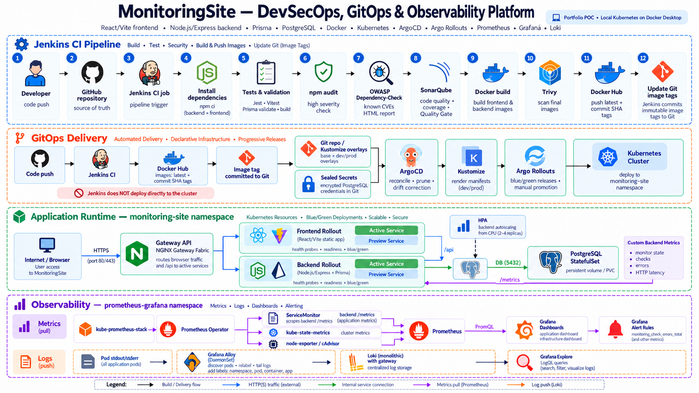

### Delivery workflow

Jenkins owns **continuous integration**: it tests and analyzes the code, builds the Docker images, scans them, and pushes immutable commit tags to Docker Hub, then commits the new image tags to Git. It does **not** deploy directly to the cluster.

ArgoCD owns **continuous delivery**: it reconciles the production Kustomize overlay from Git, applies drift correction, and lets Argo Rollouts run blue/green releases with manual promotion after preview validation.

## Application

Users can register URLs, trigger HTTP checks, and inspect uptime status and response history.

Each check produces one of four states:

- `UP`: successful response within the configured threshold
- `SLOW`: successful response above the response-time threshold
- `DOWN`: HTTP error or network failure
- `UNKNOWN`: monitor has not been checked yet

The interface contains a dashboard, monitor list, monitor details, and global check history.


## Technology stack

**Application**

- React 18, Vite, React Router, React Query, Axios
- Node.js, Express 5, Zod, Prisma
- PostgreSQL

**CI and security**

- Jenkins
- Jest and Vitest
- npm audit and OWASP Dependency-Check
- SonarQube
- Trivy

**Containers and delivery**

- Docker and Docker Compose
- Docker Hub
- Kubernetes and Kustomize
- ArgoCD
- Sealed Secrets
- Argo Rollouts
- NGINX Gateway Fabric and Gateway API
- metrics-server and HPA

**Observability**

- kube-prometheus-stack (Prometheus, Grafana, Prometheus Operator, kube-state-metrics, node-exporter)
- Custom backend metrics (`prometheus-io/client`) exposed on `/metrics` and collected with a `ServiceMonitor`
- Grafana Loki (Helm, monolithic deployment) and Grafana Alloy (DaemonSet) for cluster-wide log shipping
- LogQL in Grafana Explore; PromQL for dashboards and alerts

## Evolution of the project

### V1 — Docker and Jenkins

The first version established the application, local Docker Compose architecture, and Jenkins pipeline. Nginx was the only service exposed to the host and routed `/` to the frontend and `/api` to the backend. Backend, frontend, and PostgreSQL remained on an internal Docker network.

The pipeline installs dependencies, runs backend and frontend tests, performs quality and security checks, builds separate Docker images, scans them, and publishes both commit-specific and `latest` tags to Docker Hub.

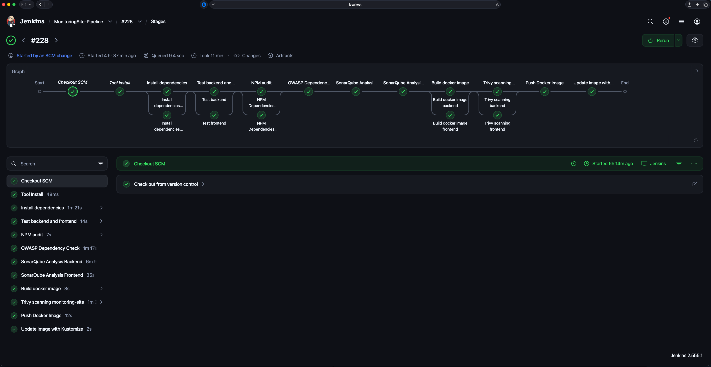

The backend repository below demonstrates the tagging strategy used for both application images: `latest` identifies the newest build, while commit SHA tags preserve traceable and immutable versions.

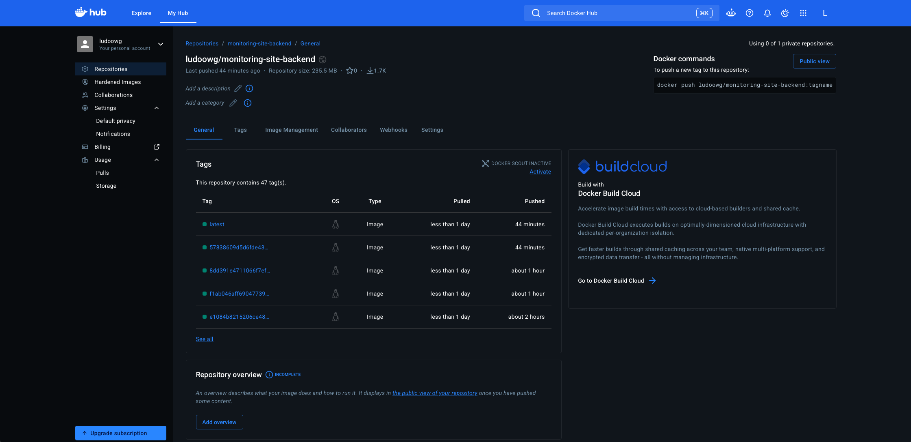

### V2 — Kubernetes and GitOps

The second version moved orchestration to Kubernetes:

- Kustomize generates development and production configurations from a shared base.
- ArgoCD continuously reconciles the production overlay from Git.
- Sealed Secrets allows the encrypted PostgreSQL Secret to be versioned safely.
- Argo Rollouts replaces Deployments with controlled blue/green releases.
- Active and preview Services separate stable traffic from release validation.
- Gateway API routes browser and API traffic to the active versions.
- The backend HPA scales its Rollout between 2 and 4 replicas from CPU metrics.

The Kubernetes environment currently runs locally with Docker Desktop.

### GitOps reconciliation

The ArgoCD application view provides a single representation of the desired resources and their live Kubernetes state. The production application is synchronized and healthy, including its Rollouts, Services, PostgreSQL resources, Gateway API resources, HPA, and SealedSecret.

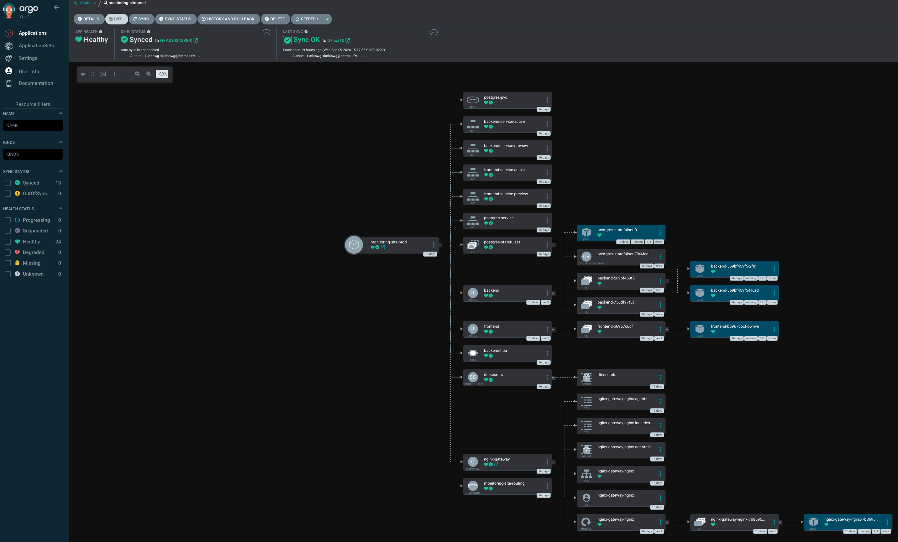

### Blue/green promotion

During a release, the existing revision remains stable and active while the candidate revision is available through the preview Service. Automatic promotion is disabled so the candidate can be validated first.

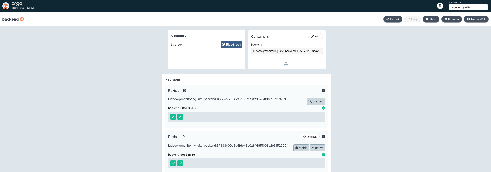

After manual promotion, the candidate becomes the stable and active revision. The previous revision remains available temporarily for rollback.

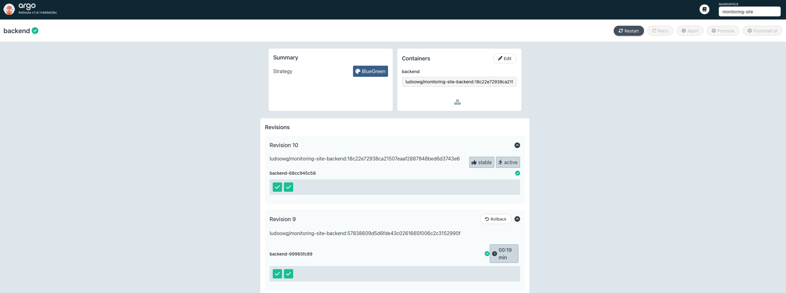

### V3 — Observability

The third iteration adds a full observability layer on the local Kubernetes cluster (`prometheus-grafana` namespace). Metrics use a **pull** model (Prometheus scrapes exporters and application endpoints). Logs use a **push** model (Alloy forwards log streams to Loki).

```text
Application /metrics  ←── ServiceMonitor ──  Prometheus  ←── PromQL ──  Grafana
Cluster & node metrics ←── Helm stack scrape ──  (same Prometheus)

Pod stdout/stderr  →  Alloy DaemonSet (log tail per node)  →  Loki gateway  →  Grafana (LogQL)
```

#### Application instrumentation

The backend registers custom Prometheus metrics in `backend/metrics/prometheus_client.js`:

- **Gauge** `monitoring_monitors` — monitor count by status (`UP`, `DOWN`, `SLOW`, `UNKNOWN`), refreshed on each `/metrics` scrape from the database
- **Counters** `monitoring_checks_total`, `monitoring_check_errors_total`, `monitoring_http_requests_total`
- **Histograms** `monitoring_check_duration_seconds`, `monitoring_http_request_duration_seconds`

A Prometheus middleware records HTTP request volume and latency (method, route, status code). Check metrics are updated when a manual HTTP check runs through the API. Default Node.js process metrics are also exported.

Prometheus does not discover the backend automatically: a `ServiceMonitor` (`k8s/base/backend-service-monitor.yaml`) selects the active backend Service and scrapes `/metrics` every 30 seconds. The Helm release label `release: prometheus` matches the Prometheus Operator configuration.

#### Grafana — application dashboard

The application dashboard focuses on **business and API behavior**:

| Panel | What it shows |
| --- | --- |
| Monitors by status | Current distribution of monitor states (gauge) |
| Checks total | Cumulative number of executed checks (counter) |
| Checks rate | Checks per second over time (`rate` on `monitoring_checks_total`) |
| Checks by result | Check rate split by `UP` / `DOWN` / `SLOW` / `UNKNOWN` |
| Check duration (p95) | 95th percentile of external check duration (histogram) |
| Check errors by type | Failures categorized as `timeout`, `http_5xx`, DNS, network, etc. |
| HTTP requests/sec | API throughput (`rate` on `monitoring_http_requests_total`) |
| HTTP latency (p95) | 95th percentile of in-app request duration |

Together, these panels correlate synthetic checks (URL probes) with real API traffic on the Monitoring Site backend.

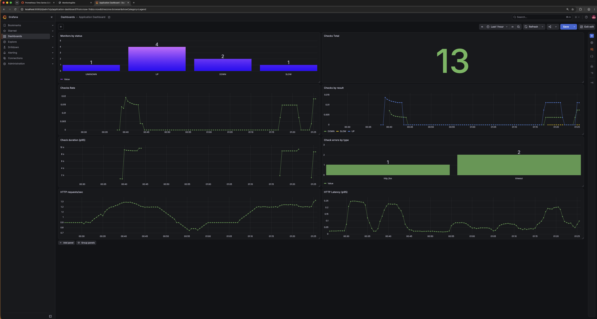

#### Grafana — infrastructure dashboard

The infrastructure dashboard uses metrics from **kube-state-metrics** and **cAdvisor** (via the kube-prometheus-stack), not from application code:

| Panel | What it shows |
| --- | --- |
| Ready pods | Count of ready pods for backend, frontend, and PostgreSQL |
| Readiness by pod | Per-pod readiness for traffic |
| Restarts by pod | Container restart counts (stability signal) |
| HPA replicas | Desired vs current replicas for the backend HorizontalPodAutoscaler |
| Memory by pod | Container working-set memory (RAM on the node, not PVC disk usage) |
| CPU by pod | CPU usage in cores (`rate` on `container_cpu_usage_seconds_total`) |

This view links application load to scaling and resource usage—for example, HPA scaling the backend between 1 and 3 replicas under CPU pressure.

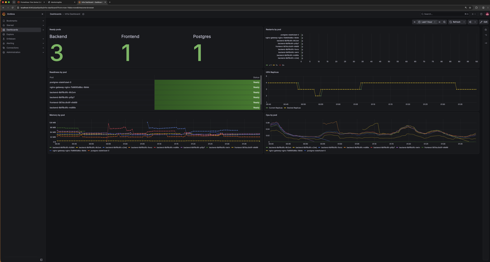

#### Loki and Alloy

**Loki** stores and indexes log streams. It is installed with the Grafana Community Helm chart using `loki-values.yaml`: monolithic (`singleBinary`) mode, **filesystem** storage for local development, MinIO and Memcached caches disabled, and `auth_enabled: false` so Grafana and Alloy do not require a tenant header.

**Alloy** runs as a **DaemonSet** (Helm `controller.type: daemonset` in `alloy-values.yaml`) so every node tails the logs of local pods and forwards them to Loki. The River pipeline:

1. `discovery.kubernetes` — discover pods
2. `discovery.relabel` — attach query-friendly labels (`namespace`, `pod`, `container`, `app`)
3. `loki.source.kubernetes` — tail pod logs
4. `loki.write` — push to `http://loki-gateway.prometheus-grafana.svc.cluster.local/loki/api/v1/push`

Grafana uses the in-cluster Loki URL (`http://loki-gateway.prometheus-grafana.svc.cluster.local`) as a data source. LogQL filters logs by labels—for example, backend pods in the application namespace:

```logql
{namespace="monitoring-site", pod=~"backend-.*"}
```

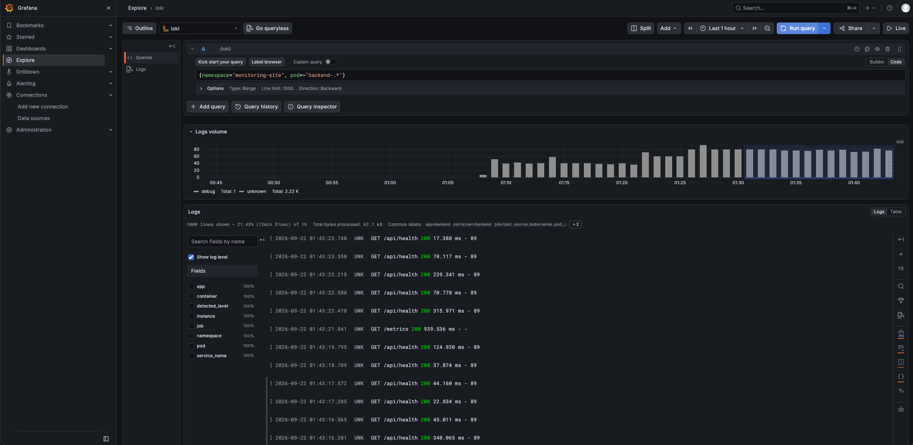

Structured access logs (for example `GET /api/health`) appear in Explore; free-text filters such as `|~ "error|timeout|failed"` only return lines that match those words, which may differ from check failures recorded in Prometheus metrics.

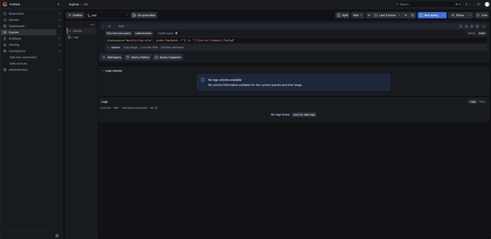

#### Alerting

A Grafana-managed alert rule watches Prometheus metric `monitoring_check_errors_total`. When `sum(increase(monitoring_check_errors_total[5m]))` is above zero, the rule moves to **Firing**; otherwise it stays **Normal**. Evaluation runs every minute. A contact point can be added later for Slack or email notifications.

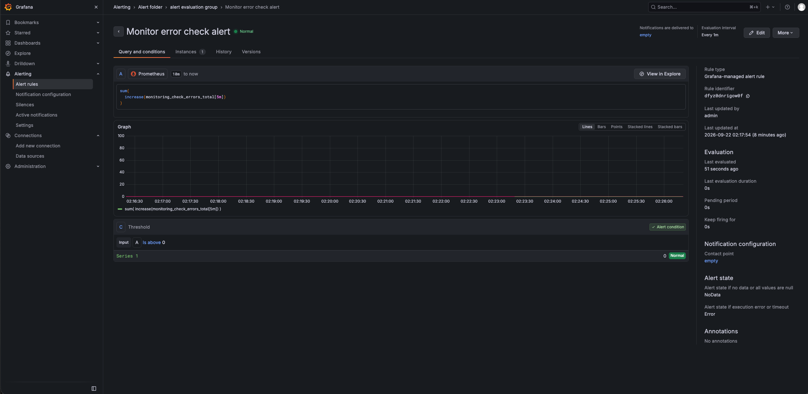

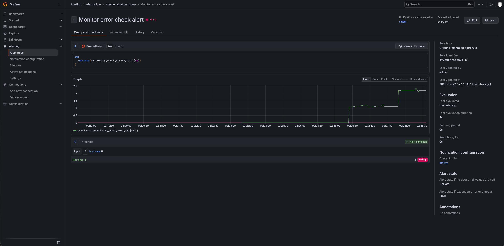

## Key technical decisions

### ArgoCD instead of deploying from Jenkins

Jenkins builds, validates, and publishes artifacts, but does not run `kubectl apply`. It commits the new immutable image tags to Git. ArgoCD then reconciles the cluster, keeping Git as the deployment source of truth and avoiding direct cluster credentials in Jenkins.

### Sealed Secrets instead of plaintext Kubernetes Secrets

The plaintext Secret remains local. Only a SealedSecret encrypted for the cluster is committed. ArgoCD applies it, and the Sealed Secrets controller creates the Kubernetes Secret without exposing plaintext values in Git.

### Blue/green releases

The stable version continues serving users while a candidate version starts behind a preview Service. Automatic promotion is disabled so the candidate can be checked before the active Service switches to it.

### Kustomize overlays

A shared base avoids duplicating manifests, while overlays customize replica counts, resources, HPA configuration, and production image tags.

### Stateful PostgreSQL

PostgreSQL uses a StatefulSet, stable internal Service, and PersistentVolumeClaim. Database data survives pod recreation as long as the underlying volume is retained.

### ServiceMonitor instead of manual Prometheus config

The backend scrape job is declared as a Kubernetes CRD and versioned in Git with the application manifests. The Prometheus Operator picks it up when the Service labels and the `release: prometheus` label align with the Helm release.

### Local Loki footprint

Production-style Loki often relies on object storage (S3-compatible) and optional caches. For Docker Desktop, the chart is tuned for a smaller footprint: filesystem storage, no bundled MinIO, caches and canary disabled, and single-binary mode so the lab cluster remains schedulable.

### Metrics vs logs for failures

Check failures increment Prometheus counters (`monitoring_check_errors_total`) and appear on Grafana dashboards and alerts. Container logs complement debugging (HTTP access lines, stack traces) but do not always contain the same keywords as failed external checks.

## Challenges and lessons learned

- Resolved a conflicting GatewayClass by letting NGINX Gateway Fabric own the class installed by Helm.
- Replaced strategic merge patches with JSON 6902 patches when Kustomize could not safely merge container fields in the Rollout CRD.
- Added ArgoCD `ignoreDifferences` for the backend Rollout replica field so self-healing does not conflict with HPA decisions.
- Diagnosed an ArgoCD Application deletion blocked by its resource finalizer.
- Migrated from a manually created Secret to a SealedSecret compatible with GitOps.
- Separated permanent Kubernetes resources and sync waves from temporary ArgoCD hooks.
- Tuned the Loki Helm chart for a constrained local cluster (filesystem storage, disabled caches, Helm test/canary off) and fixed Grafana connectivity by ensuring the Loki single-binary pod stays ready behind the gateway.
- Distinguished pull-based metric scraping from push-based log ingestion when wiring Prometheus, Loki, and Alloy together.

## Local Docker usage

Copy the example environment files:

```bash
cp .env.example .env
cp backend/.env.example backend/.env
cp frontend/.env.example frontend/.env
```

Build and start the local stack:

```bash
docker compose up --build
```

Open:

- Application: http://localhost:8081
- API health: http://localhost:8081/api/health

Pre-built images can be used with:

```bash
docker compose -f docker-compose.prod.yml pull
docker compose -f docker-compose.prod.yml up -d
```

## Documentation

- [Jenkins CI/CD pipeline](docs/ci-cd.md)
- [Kubernetes, ArgoCD, Sealed Secrets, and Argo Rollouts](docs/kubernetes.md)
- [Backend API documentation](backend/README.md)

## Current scope 

This project demonstrates a local production-like delivery platform. It is not currently deployed as a public production service.


