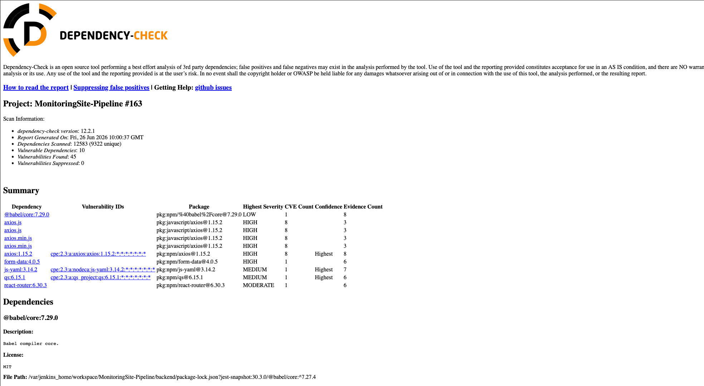
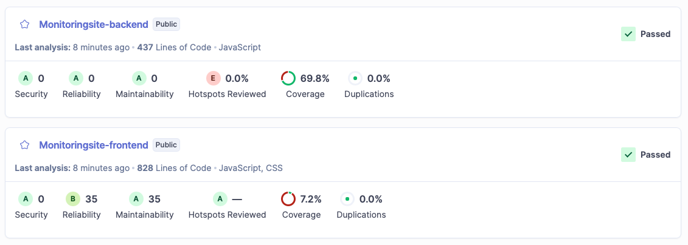
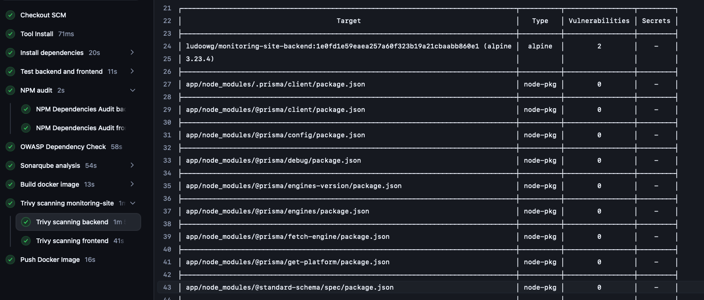

# CI/CD with Jenkins

This document describes the Jenkins pipeline used to test the application, run quality and security checks, build versioned Docker images, publish them, and update the Kubernetes production overlay.

Return to the [main README](../README.md) or read the [Kubernetes and GitOps documentation](kubernetes.md).

## Jenkins environment

Jenkins runs locally in a Docker container built from `Dockerfile.jenkins`. It is configured with Node.js, Docker, Kustomize, OWASP Dependency-Check, SonarQube Scanner, and the HTML Publisher plugin.

Credentials used by the pipeline are stored in Jenkins rather than committed to Git. The pipeline also uses a build discarder to retain only the latest 30 builds and archived artifacts.


## Pipeline stages

### 1. Dependency installation

Backend and frontend dependencies are installed in parallel with `npm ci`. Unlike `npm install`, this uses the lockfiles to make dependency installation deterministic across local and CI environments.

### 2. Tests and build validation

Backend and frontend tests run in parallel:

- Jest runs the backend tests and produces a coverage report.
- `prisma validate` checks the Prisma schema.
- Vitest runs the frontend tests and produces coverage.
- A production frontend build verifies that Vite can compile the application.

### 3. Dependency security checks

`npm audit` scans backend and frontend dependencies for high-severity vulnerabilities. OWASP Dependency-Check complements it by looking for known CVEs and generating an HTML report published by Jenkins.



### 4. Static analysis

SonarQube analyzes the backend and frontend as separate projects. It reports bugs, code smells, duplicated code, reliability issues, maintainability issues, and coverage gaps.

The Quality Gate determines whether the analyzed code meets the expected quality level before delivery continues.



### 5. Docker image build

The pipeline builds two independent images:

- `ludoowg/monitoring-site-backend`
- `ludoowg/monitoring-site-frontend`

Each image receives two tags:

- `$GIT_COMMIT` provides an immutable and traceable application version.
- `latest` identifies the most recently built image for local usage.

The frontend build receives `VITE_API_URL=/api` because Vite injects this value into the static bundle at build time.

### 6. Container image scanning

Trivy scans both images for `HIGH` and `CRITICAL` vulnerabilities. Human-readable results are printed in the Jenkins logs and JSON reports are archived as build artifacts.



### 7. Image publication

After validation, Jenkins pushes both the commit-specific and `latest` tags to Docker Hub.

The backend repository illustrates the same tagging strategy used for both backend and frontend images:


### 8. GitOps handoff

Jenkins does not apply Kubernetes manifests directly. Instead, it uses Kustomize to update the backend and frontend image tags in `k8s/overlays/prod/kustomization.yaml`.

It then commits this change with `[skip ci]` and pushes it to GitHub. ArgoCD detects the new desired state and reconciles the Kubernetes cluster. This separation keeps Git as the source of truth and gives Jenkins responsibility for CI and image publication while ArgoCD handles delivery to Kubernetes.

```text
Git push
  → Jenkins tests and scans
  → Docker images tagged with the commit SHA
  → Docker Hub
  → production Kustomize tags updated in Git
  → ArgoCD reconciliation
  → Argo Rollouts blue/green release
```

## Design decisions

### Separate frontend and backend images

The services use different runtimes and release independently. Separate images allow Jenkins to build, scan, version, and publish each component without coupling their runtime layers.

### Immutable commit tags

Commit SHA tags connect source code, CI execution, container image, and Kubernetes deployment. They also make it possible to return to a previously validated version without relying on the mutable `latest` tag.

### GitOps instead of `kubectl apply` in Jenkins

Jenkins only updates the desired image versions in Git. It does not require direct deployment access to the Kubernetes cluster. ArgoCD owns reconciliation, drift correction, and deployment visibility.
